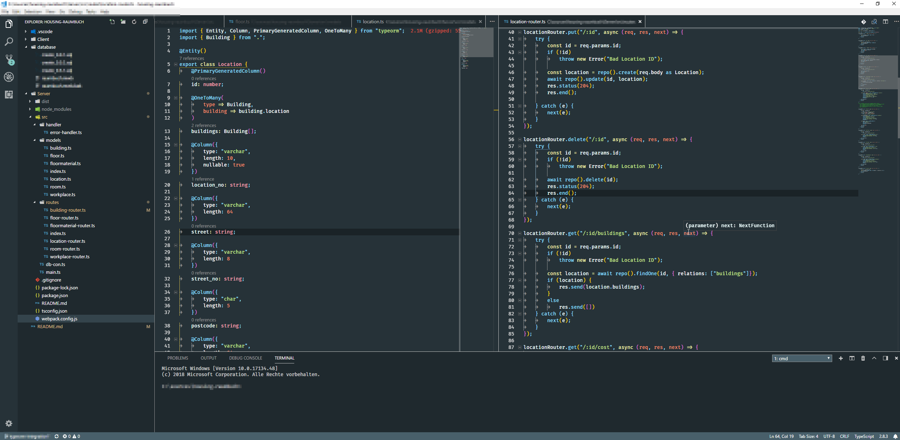

# Zeal - An eyes relieving theme

The goal of this extension / theme was to provide a dark theme with blunted colours.
I suffer from Red–green color blindness, hence my eyes are more sensitive to jazzy & piercing colours, which are widely used in the community for dark themes.

Since I mainly do web development in VS Code I cannot really ensure how the colours for specific languages will look like.
For myself I can tell that <code>JavaScript, TypeScript, CSS, HTML, Markdown, JSON</code> are fine.

## Zeal Theme With TypeScript

## Zeal Theme With TypeScript

